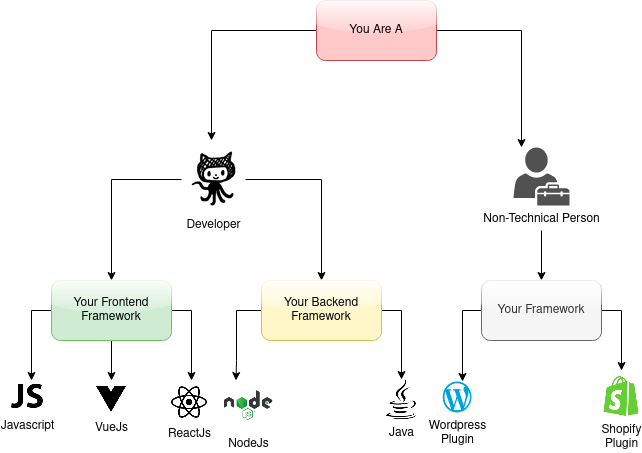

# Let's Secure Your App Now!

Now that you have registered your App and have generated \`hypersign.json\` file, its time to implement the Hypersign dAuth protocol in your app. Kindly take help of this decision tree to understand SDK / Plugin you need for your project.


[sdk](../sdk/)



[plugins](../plugins/)

