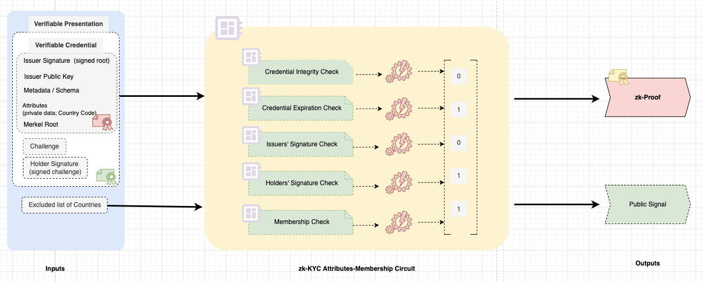

# Introduction

### Basic Architecture and Flow

<figure><figcaption></figcaption></figure>

1. The user navigates to the dApp’s UI.
2. The dApp prompts the user to connect their wallet.
3. The user connects and provides their wallet address.
4. The dApp checks the Trusted Issuer’s Token contract (Hypersign KYC Token Contract) to verify if the user has already minted a ProofOfKYC Soulbound Token.
5. If not, the user initiates the on-chain KYC process through the Hypersign KYC widget:
   1. The user completes a liveness check by providing video KYC and receives a PersonhoodCredential from the KYC server, which is stored in their data vault.
   2. The user then proceeds with ID verification, receives a KYCCredential from the KYC server, and stores it in their data vault.&#x20;
6. Next, the user begins with the on-chain ID minting.
   1. User generates requested zero knowledge proofs (supported proofs) from their respective credentials
   2. User then submit zk proofs to the issuer contracts and requests for respective KYC tokens (which is basically SBTs)&#x20;
   3. The Issuer contract verifies the zk proof and mints KYC token in user’s wallet address.&#x20;
7. The user provides consent for data access to the dApp.
8. Upon receiving the user’s consent, the dApp calls the its smart contract to perform on-chain ID verification.
9. The smart contract queries the trusted Issuer’s KYC token contract to check if the wallet address has required KYC tokens. If found, the user is considered verified on-chain.


ZK proofs and OnChain ID are optional; if you prefer not to use OnChain ID, you can still verify a user's ID off-chain.



ZK proofs can be used independently in off-chain mode without requiring OnChain ID (token minting). It is not mandatory to use ZK proofs exclusively with OnChain ID. However, the reverse is not possible; OnChain ID requires ZK proofs.


Now, let's proceed with the integration:


[integrations](integrations/)

